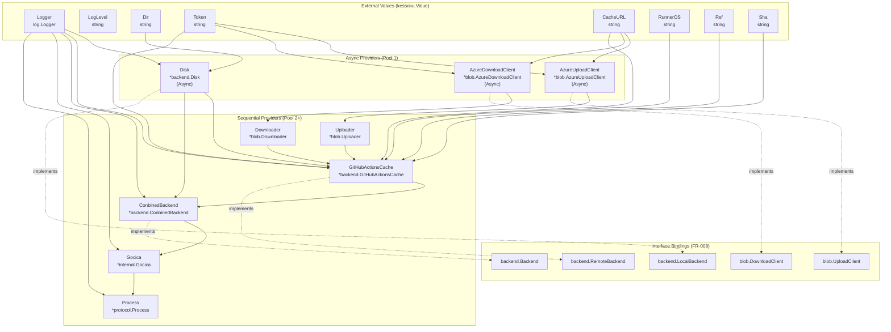

# Data Model: Kessoku DI Integration

**Date**: 2025-12-27
**Status**: Complete

## Overview

This document defines the DI provider entities, their dependencies, and the generated injector structure for the kessoku DI integration.

## Entity Definitions

### Injector: InitializeProcess

**Target Type**: `*protocol.Process`
**Signature** (per FR-002):
```go
func InitializeProcess(ctx context.Context) (*protocol.Process, error)
```

- `ctx context.Context` is the only parameter (required for async providers)
- Logger and config values are injected via `kessoku.Value` inside the injector declaration
- Returns `(*protocol.Process, error)`



## Provider Definitions

### 1. Logger Provider (Value)

```go
kessoku.Value(logger)  // log.Logger
```

**Type**: `log.Logger`
**Source**: External (created in main based on CLI log level, per FR-011)
**Dependency of**: Disk, GitHubActionsCache, ConbinedBackend, Gocica, Process

---

### 2. Configuration Values (Value)

```go
kessoku.Value(CLI.LogLevel)         // string - log level
kessoku.Value(CLI.Dir)              // string - cache directory
kessoku.Value(CLI.Github.Token)     // string - GitHub token
kessoku.Value(CLI.Github.CacheURL)  // string - Actions cache URL
kessoku.Value(CLI.Github.RunnerOS)  // string - runner OS
kessoku.Value(CLI.Github.Ref)       // string - GitHub ref
kessoku.Value(CLI.Github.Sha)       // string - GitHub SHA
```

**Source**: CLI struct (parsed in main, per FR-011)
**Injected per**: FR-009

---

### 3. Disk Provider (Async)

```go
kessoku.Async(kessoku.Bind[backend.LocalBackend](kessoku.Provide(backend.NewDisk)))
```

**Type**: `*backend.Disk`
**Implements**: `backend.LocalBackend` (FR-008)
**Dependencies**:
- `log.Logger` (value)
- `dir string` (value - cache directory path)

**Constructor Signature**:
```go
func NewDisk(logger log.Logger, dir string) (*Disk, error)
```

**Async Rationale** (FR-004): Directory creation is independent - only depends on logger and dir values.

---

### 4. AzureUploadClient Provider (Async)

```go
kessoku.Async(kessoku.Bind[blob.UploadClient](kessoku.Provide(blob.NewAzureUploadClient)))
```

**Type**: `*blob.AzureUploadClient`
**Implements**: `blob.UploadClient` (FR-008)
**Dependencies**:
- `token string` (value)
- `cacheURL string` (value)

**Async Rationale** (FR-004): Part of "GitHub Actions Cache client setup (HTTP client, URL parsing)" - only depends on token and cacheURL values, runs in parallel with Disk.

**Note**: Exposed in injector graph per FR-008 to enable test mocking.

---

### 5. AzureDownloadClient Provider (Async)

```go
kessoku.Async(kessoku.Bind[blob.DownloadClient](kessoku.Provide(blob.NewAzureDownloadClient)))
```

**Type**: `*blob.AzureDownloadClient`
**Implements**: `blob.DownloadClient` (FR-008)
**Dependencies**:
- `token string` (value)
- `cacheURL string` (value)

**Async Rationale** (FR-004): Part of "GitHub Actions Cache client setup (HTTP client, URL parsing)" - only depends on token and cacheURL values, runs in parallel with Disk.

**Note**: Exposed in injector graph per FR-008 to enable test mocking.

---

### 6. Uploader Provider (Sequential)

```go
kessoku.Provide(blob.NewUploader)
```

**Type**: `*blob.Uploader`
**Dependencies**:
- `blob.UploadClient` (from AzureUploadClient)

---

### 7. Downloader Provider (Sequential)

```go
kessoku.Provide(blob.NewDownloader)
```

**Type**: `*blob.Downloader`
**Dependencies**:
- `blob.DownloadClient` (from AzureDownloadClient)

---

### 8. GitHubActionsCache Provider (Sequential)

```go
kessoku.Bind[backend.RemoteBackend](kessoku.Provide(backend.NewGitHubActionsCache))
```

**Type**: `*backend.GitHubActionsCache`
**Implements**: `backend.RemoteBackend` (FR-008)
**Dependencies**:
- `log.Logger` (value)
- `token string` (value)
- `cacheURL string` (value)
- `runnerOS string` (value)
- `ref string` (value)
- `sha string` (value)
- `backend.LocalBackend` (from Disk - for blob download paths)
- `*blob.Uploader` (for upload operations)
- `*blob.Downloader` (for download operations)

**Constructor Signature** (modified for DI):
```go
func NewGitHubActionsCache(
    logger log.Logger,
    token, cacheURL, runnerOS, ref, sha string,
    localBackend LocalBackend,
    uploader *blob.Uploader,
    downloader *blob.Downloader,
) (*GitHubActionsCache, error)
```

**NOT Async**: Depends on LocalBackend (Disk), so cannot run in parallel with Disk initialization.

---

### 9. ConbinedBackend Provider (Sequential)

```go
kessoku.Bind[backend.Backend](kessoku.Provide(backend.NewConbinedBackend))
```

**Type**: `*backend.ConbinedBackend`
**Implements**: `backend.Backend` (FR-008)
**Dependencies**:
- `log.Logger` (value)
- `backend.LocalBackend` (from Disk)
- `backend.RemoteBackend` (from GitHubActionsCache)

**Constructor Signature**:
```go
func NewConbinedBackend(logger log.Logger, local LocalBackend, remote RemoteBackend) (*ConbinedBackend, error)
```

---

### 10. Gocica Provider (Sequential)

```go
kessoku.Provide(internal.NewGocica)
```

**Type**: `*internal.Gocica`
**Dependencies**:
- `log.Logger` (value)
- `backend.Backend` (from ConbinedBackend)

**Constructor Signature**:
```go
func NewGocica(logger log.Logger, backend backend.Backend) *Gocica
```

---

### 11. Process Provider (Sequential)

```go
kessoku.Provide(NewProcessWithOptions)
```

**Type**: `*protocol.Process`
**Dependencies**:
- `log.Logger` (value - via ProcessOption)
- `*internal.Gocica` (for handlers - via ProcessOption)

**Note**: Process uses functional options pattern. A wrapper function constructs ProcessOptions:

```go
func NewProcessWithOptions(logger log.Logger, gocica *internal.Gocica) *protocol.Process {
    return protocol.NewProcess(
        protocol.WithLogger(logger),
        protocol.WithGetHandler(gocica.Get),
        protocol.WithPutHandler(gocica.Put),
        protocol.WithCloseHandler(gocica.Close),
    )
}
```

---

## Interface Bindings Summary (FR-008)

| Interface | Implementation | Package | Binding |
|-----------|---------------|---------|---------|
| `backend.Backend` | `*backend.ConbinedBackend` | `internal/backend` | `kessoku.Bind[backend.Backend]` |
| `backend.LocalBackend` | `*backend.Disk` | `internal/backend` | `kessoku.Bind[backend.LocalBackend]` |
| `backend.RemoteBackend` | `*backend.GitHubActionsCache` | `internal/backend` | `kessoku.Bind[backend.RemoteBackend]` |
| `blob.UploadClient` | `*blob.AzureUploadClient` | `internal/backend/blob` | `kessoku.Bind[blob.UploadClient]` |
| `blob.DownloadClient` | `*blob.AzureDownloadClient` | `internal/backend/blob` | `kessoku.Bind[blob.DownloadClient]` |

All 5 interfaces from FR-008 are bound and exposed in the injector graph for test mocking.

---

## Execution Pools

Based on kessoku's parallel execution analysis:

**Pool 1 (Async - all run in parallel)**:
- Disk (directory creation)
- AzureUploadClient (HTTP client setup)
- AzureDownloadClient (HTTP client setup)

**Pool 2 (Sequential, after Pool 1)**:
- Uploader (depends on AzureUploadClient)
- Downloader (depends on AzureDownloadClient)

**Pool 3 (Sequential, after Pool 2)**:
- GitHubActionsCache (depends on Disk + Uploader + Downloader)

**Pool 4 (Sequential, after Pool 3)**:
- ConbinedBackend (depends on Disk + GitHubActionsCache)

**Pool 5 (Sequential, after Pool 4)**:
- Gocica (depends on ConbinedBackend)

**Pool 6 (Sequential, after Pool 5)**:
- Process (depends on Gocica)

**FR-004 Compliance**: Per spec, both "Disk initialization" and "GitHub Actions Cache client setup (HTTP client, URL parsing)" run async. The blob clients (AzureUploadClient/AzureDownloadClient) represent the HTTP client/URL parsing portion of GitHub Actions Cache setup.

---

## Error States

| Provider | Error Condition | Handling |
|----------|-----------------|----------|
| Disk | Directory creation fails | Injector returns error |
| AzureUploadClient | Invalid token/URL | Injector returns error |
| AzureDownloadClient | Invalid token/URL | Injector returns error |
| GitHubActionsCache | Network error, invalid config | Injector returns error |
| ConbinedBackend | Internal initialization fails | Injector returns error |

**Degraded Mode (FR-007)**: When injector returns error, main.go logs warning and creates a minimal Process without backend handlers (no-cache mode).

---

## Validation Rules

1. **Logger**: Must be non-nil (created before injector call, per FR-011)
2. **Dir**: Must be valid directory path (validated by Disk constructor)
3. **Token**: Required for remote backend (empty string triggers error)
4. **CacheURL**: Required for remote backend (validated by blob clients)
5. **Ref/Sha**: Required for cache key generation

---

## State Transitions

Not applicable - DI initialization is a one-time operation during application startup.
